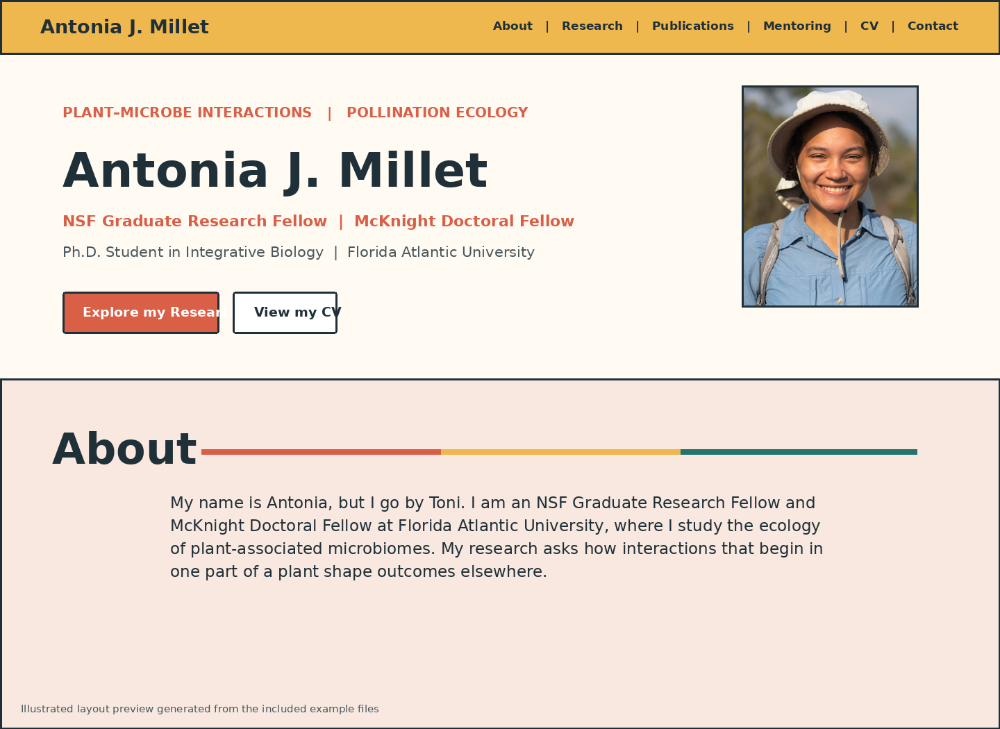

# Build an Academic Website with GitHub Pages

A beginner-friendly guide by Antonia J. Millet.

A beginner-friendly guide for undergraduate students, graduate students, research staff, and other academics who want a professional website but do not consider themselves programmers.

This repository teaches a practical workflow:

1. Plan what your website needs to communicate.
2. Study several academic websites for organization and design ideas.
3. Learn the purpose of the major sections of HTML, CSS, and JavaScript.
4. Customize a working example with your own writing, images, links, and CV.
5. Publish the website through GitHub Pages.

The goal is not to copy another person's website. The goal is to recognize useful design patterns, understand how the code is organized, and rebuild those ideas around your own work and identity.



## Do you have to use GitHub?

No. A website builder may be the better choice when you need the fastest possible setup and do not want to work with code.

Common options include:

| Option | Best for | Main limitation |
|---|---|---|
| Google Sites | A very quick, simple site | Limited visual control |
| Wix, Weebly, or Squarespace | Drag-and-drop design | Features, branding, or publishing options may depend on the plan |
| WordPress.com | Blogging and expandable sites | More platform-specific setup and maintenance |
| A university profile | Basic institutional visibility | Usually limited design control and may not follow you when you leave |
| GitHub Pages | A portable, customizable academic site | Requires learning a small amount about files and code |

## Why this guide uses GitHub Pages

GitHub Pages publishes HTML, CSS, and JavaScript directly from a GitHub repository. For a public repository, it is available through GitHub Free. It also supports custom domains and HTTPS.

For an early-career researcher, GitHub provides several useful things at once:

- a professional website;
- a public record of how the website was built;
- version history, so mistakes can be reversed;
- complete control over the website files;
- a structure that can move with you between universities;
- experience with GitHub, file organization, HTML, and CSS;
- an easy way to share a reusable template or teaching resource.

GitHub is not automatically the best option for everyone. It is the strongest option for this guide because the site can be understood, documented, changed, and shared without being locked inside a drag-and-drop platform.

## Start here

| Chapter | What you will do |
|---|---|
| [1. Plan your website](guide/01-plan-your-website.md) | Decide the audience, sections, writing, images, and links |
| [2. Find design inspiration](guide/02-find-design-inspiration.md) | Study academic sites without copying them |
| [3. View and understand code](guide/03-view-and-understand-code.md) | Learn what HTML, CSS, and JavaScript control |
| [4. Customize your content](guide/04-customize-your-content.md) | Turn the example into your own website |
| [5. Publish with GitHub Pages](guide/05-publish-with-github-pages.md) | Upload, publish, update, and troubleshoot the site |

## How this repository is organized

```text
academic-website-guide/
├── README.md
├── SOURCES.md
├── guide/
│   ├── 01-plan-your-website.md
│   ├── 02-find-design-inspiration.md
│   ├── 03-view-and-understand-code.md
│   ├── 04-customize-your-content.md
│   ├── 05-publish-with-github-pages.md
│   └── images/
├── code-notes/
│   ├── html-overview.md
│   ├── css-overview.md
│   ├── navigation.md
│   ├── about-section.md
│   ├── project-cards.md
│   ├── mobile-layout.md
│   └── analytics-and-redirects.md
├── example-website/
│   ├── index.html
│   ├── styles.css
│   ├── script.js
│   ├── robots.txt
│   ├── sitemap.xml
│   ├── assets/
│   └── go/
└── LICENSE.md
```

### `guide/`

The step-by-step instructions. Read these in order.

### `code-notes/`

Short explanations of the important parts of the example code: what they control, what you can change, and what should remain connected.

### `example-website/`

A complete working academic website. It is included as a reference, not as a requirement that every academic site look the same.

## Familiarize yourself with the code before changing it

You do not need to understand every line. You should know which file and section controls the part you want to edit.

- **HTML** contains the words, links, images, and page structure.
- **CSS** controls colors, fonts, spacing, cards, and responsive layout.
- **JavaScript** handles small interactive or automatic behaviors.

Use the [annotated code notes](code-notes/html-overview.md) while reading the example files.

## Important: replace the personal materials

The example contains Antonia J. Millet's writing, photographs, links, CV, and QR code so the repository has a complete working site. These materials demonstrate where files belong, but they are not generic template content.

Before publishing your version, replace:

- the name and biography;
- institutional and fellowship information;
- project descriptions;
- email, Google Scholar, ORCID, and GitHub links;
- photographs and image descriptions;
- CV PDF;
- website URLs in metadata, `robots.txt`, `sitemap.xml`, and the QR redirect.

## Sources and transparency

Several academic websites were reviewed for ideas about structure, navigation, research presentation, and visual hierarchy. No external personal website's code was copied into the included example. See [SOURCES.md](SOURCES.md) for the websites, documentation, and feature-level source notes.

## License

The guide, code, and personal assets do not all have the same reuse terms. Read [LICENSE.md](LICENSE.md) before adapting or redistributing the repository.


## Citation

Millet, Antonia J. 2026. *Build an Academic Website with GitHub Pages.*
