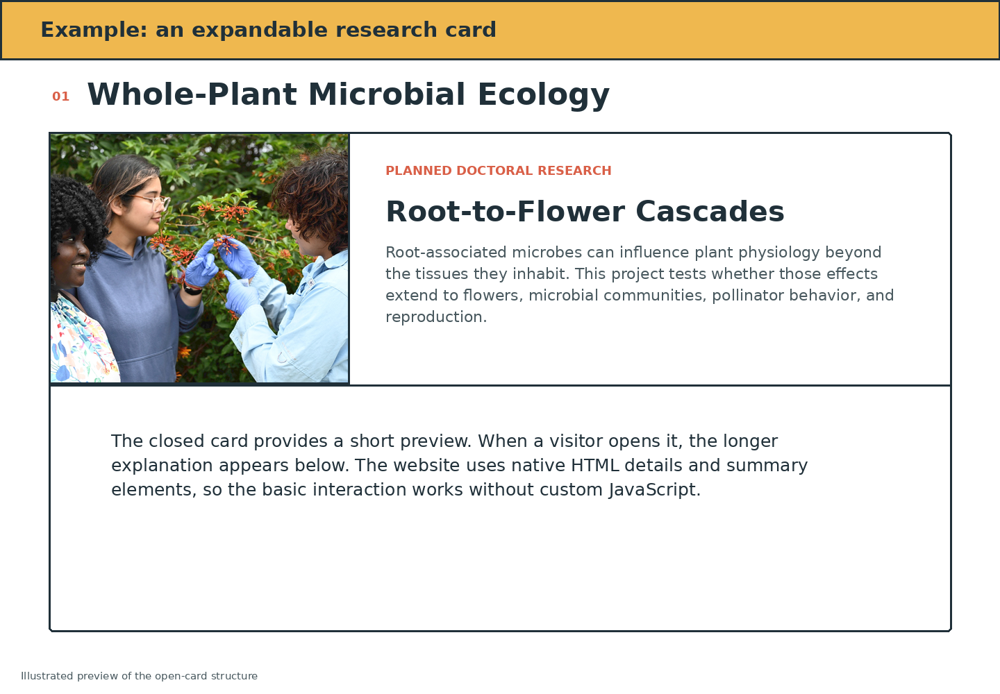

# Expandable Project Cards

[Return to the main guide](../README.md) · [Open the HTML](../reference-website/index.html) · [Open the CSS](../reference-website/styles.css)

The reference site uses native HTML `<details>` and `<summary>` elements. This creates an expandable card without custom JavaScript.



## Structure

```html
<details class="project-card">
  <summary>
    <div class="project-image">
      
    </div>

    <div class="project-introduction">
      <p class="project-status">Manuscript in preparation</p>
      <h4>Project title</h4>
      <p class="project-preview">Short preview...</p>
      <span class="project-action">Read project</span>
    </div>
  </summary>

  <div class="project-details prose">
    <p>Longer explanation...</p>
  </div>
</details>
```

The content inside `<summary>` is the closed-card view. The content after `</summary>` appears when the card opens.

## Add or remove a project

Copy or delete one complete `<details>...</details>` block. Then replace the image, `alt` text, status, title, preview, detailed paragraphs, and optional link.

Do not copy only the visible text. Missing closing tags can cause later projects or entire sections to appear inside the wrong card.
