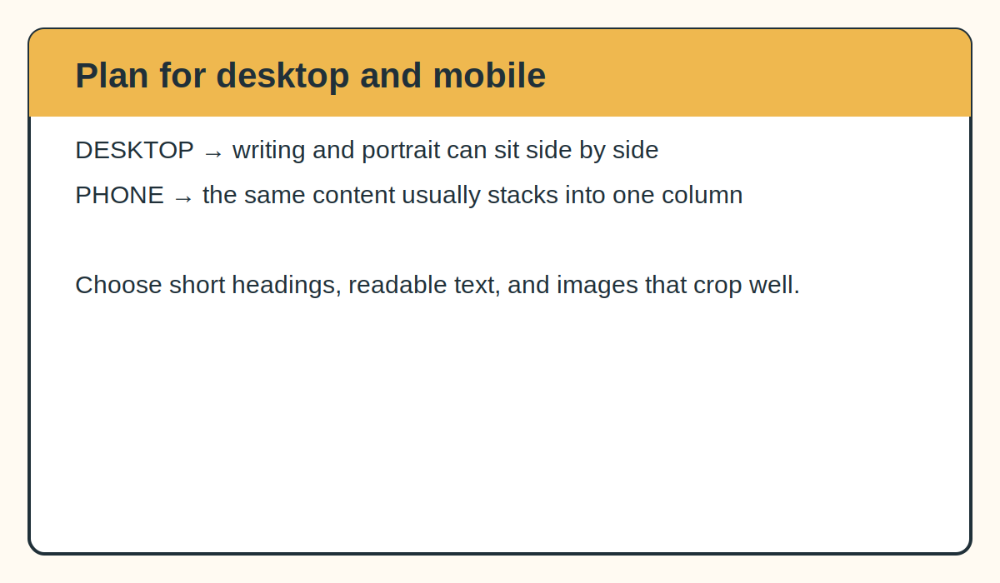

# 1. Plan Your Website

[Return to the main guide](../README.md) · [Next: Find design inspiration →](02-find-design-inspiration.md)

Do not begin with colors or code. Begin with the person who will visit the website.

## Decide what the website should do

An academic website can serve several purposes:

- introduce you to a potential advisor, collaborator, employer, or student;
- explain your research more clearly than a CV can;
- provide permanent links to your CV, publications, code, or datasets;
- show evidence of teaching, mentoring, outreach, and open science;
- give people one reliable place to find your current information.

Write one sentence that begins:

> After visiting my website, I want someone to understand that I...

That sentence will help you decide what belongs on the homepage and what can remain in the CV.

## Choose a simple site map

A first academic website does not need many pages. A one-page website can work well because visitors can scroll through the entire story.

A useful starting structure is:

```text
Home
About
Research or Projects
Publications
Teaching or Mentoring
CV
Contact
```

Not everyone needs every section. A student without publications can link to posters, presentations, fieldwork, a thesis, code, or ongoing research instead.

## Build a content inventory

Create a folder on your computer called `website-materials`.

Collect:

```text
website-materials/
├── writing/
│   ├── short-bio.txt
│   ├── research-summary.txt
│   └── project-descriptions.txt
├── images/
├── cv/
└── links.txt
```

### Writing

Prepare:

- your name exactly as you want it displayed;
- position and university;
- one short research identity line;
- a biography of approximately two or three paragraphs;
- a short explanation of each project;
- a mentoring, teaching, outreach, or service statement when relevant.

### Links

Collect:

- university email;
- CV;
- Google Scholar;
- ORCID;
- GitHub;
- laboratory or university profile;
- project pages, datasets, posters, or publications.

### Images

Choose images that help explain your work rather than acting as decoration alone.

Useful image categories include:

- a clear professional or field portrait;
- one image per research project;
- field sites;
- organisms or study systems;
- microscopy or laboratory work;
- figures that can be understood without a paper beside them.

Use descriptive filenames:

```text
about.jpeg
root-to-flower.jpeg
whole-plant-microbiome.jpeg
pollen-library.jpeg
```

Avoid names such as:

```text
IMG_4837.jpeg
final-final-2.png
Screenshot 2026-07-18.png
```

## Write for people outside your exact specialty

A potential visitor may be an ecologist who does not study microbiomes, a faculty member in another department, an undergraduate, a family member, or a search committee member moving quickly.

For each research project, answer:

1. What is the ecological question?
2. Why is the question unresolved?
3. What system or method are you using?
4. What could the answer help us understand?

The website should not duplicate your CV. The CV documents everything. The website explains the thread connecting the work.

## Plan the mobile version now

Most visitors will eventually open the website on a phone. Select images that can be cropped vertically as well as horizontally. Keep headings short enough to wrap cleanly. Avoid placing important information only inside a very wide figure.



## Checkpoint

Before continuing, you should have:

- a list of website sections;
- draft writing for each section;
- a folder of images;
- your current CV;
- a list of links;
- one sentence describing the overall story of your website.

[Return to the main guide](../README.md) · [Next: Find design inspiration →](02-find-design-inspiration.md)
