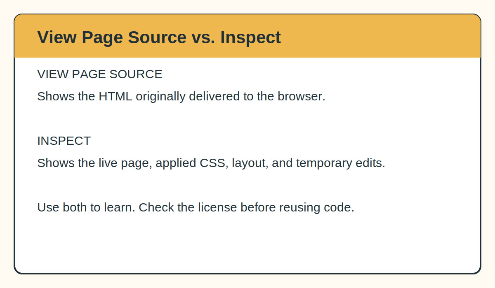

# 2. Find Design Inspiration Without Copying a Website

[← Previous: Plan your website](01-plan-your-website.md) · [Return to the main guide](../README.md) · [Next: View and understand code →](03-view-and-understand-code.md)

Starting from a completely blank page is difficult. A better approach is to study several websites and make a list of the choices you like.

The purpose is not to reproduce one person's site. It is to notice patterns:

- how quickly the homepage explains who the researcher is;
- how research projects are grouped;
- whether the site is one long page or several pages;
- how photographs and figures are used;
- where the CV and publications are placed;
- how the site changes on a phone.

## Academic and ecology website examples

These sites use different tools and approaches. Review several before deciding what your site should feel like.

| Website | Field or focus | What to observe |
|---|---|---|
| [Cole J. Doolittle](https://coledoolittle.com/) | Forest, community, and disturbance ecology | One-page flow, strong project summaries, clear visual hierarchy |
| [Juan Pablo Jordán](https://jpj73.github.io/personal_website/about.html) | Organismal biology and ecology/evolution | Simple multi-page organization and a public source repository |
| [Ken W. Zillig](https://kenzillig.github.io/aboutme/) | Fish ecophysiology and conservation | Research projects organized as separate destinations |
| [Mitchell Fennell](https://mitch-fen.github.io/) | Wildlife biology and conservation technology | A GitHub Pages academic site that also explains its own structure |
| [Brian Lee](https://bhyleee.github.io/) | Landscape ecology and environmental data science | A compact homepage combining biography, research, CV, and outputs |
| [Christopher Dutton](https://cldutton.github.io/aboutme/) | Aquatic and microbial ecology | Clear research, teaching, and publications navigation |
| [Luis D. Verde Arregoitia](https://luisdva.github.io/about/) | Macroecology, biodiversity data, and conservation | Research identity combined with publications, training, and writing |

Websites change. Treat the list as a starting point rather than a permanent ranking.

## Create an observation sheet

For each website, record only the decisions you might adapt:

```text
Website:
What becomes clear in the first 10 seconds?
Navigation:
Homepage structure:
How projects are displayed:
Use of images:
Colors and typography:
What works well:
What I would do differently:
```

After reviewing several sites, combine ideas rather than following a single model.

Example:

```text
I like:
- a one-page homepage;
- a portrait beside the research identity;
- expandable research cards;
- a separate CV link;
- project photographs;
- clear section colors.

I do not want:
- a long publication list on the homepage;
- a blog;
- complex animations;
- a separate page for every small project.
```

## View Page Source and Inspect are different



### View Page Source

This shows the HTML originally delivered to the browser.

Common shortcuts:

- Windows/Linux Chrome or Firefox: `Ctrl + U`
- Mac Chrome or Firefox: `Command + Option + U`
- You can also right-click and select **View Page Source** when the browser provides that option.

Use it to see:

- page headings and sections;
- links to CSS and JavaScript files;
- image paths;
- metadata in the `<head>`.

### Inspect

Right-click an item and choose **Inspect** to open browser developer tools.

Use it to see:

- which HTML element produced the item;
- which CSS rules control its color, size, spacing, or position;
- how the layout changes at different screen sizes.

Changes made inside Inspect are temporary. Refreshing the page restores the original website.

## Public source is not automatically reusable source

A browser must receive website code in order to display a page. That does not mean the code, writing, photographs, or design can automatically be republished.

Before reusing code:

1. Look for a linked GitHub repository.
2. Look for a `LICENSE`, `LICENSE.md`, or license statement.
3. Read what the license permits.
4. Keep any required copyright or attribution notices.
5. When no reuse license is provided, use the site for observation and write your own implementation.

A useful method is to translate a visual feature into plain language:

```text
Reference feature:
A sticky navigation bar with the name on the left and section links on the right.

My implementation:
A simple HTML header using my own class names, colors, spacing, and section links.
```

## Keep a source log

Record where ideas, templates, snippets, icons, or tutorials came from.

| Feature | Source | How it was used | License or permission |
|---|---|---|---|
| Overall project organization | Several academic websites | General inspiration only | No code copied |
| Expandable cards | Native HTML `<details>` element | Custom implementation | Web platform feature |
| Hosting steps | GitHub Pages documentation | Instructions summarized | Documentation linked |
| Icons | Example: Lucide | Files used according to license | Record the license |

The completed source log for this repository is in [SOURCES.md](../SOURCES.md).

## Checkpoint

You should now have:

- reviewed at least three academic websites;
- written a list of features you like;
- identified features you do not need;
- separated design inspiration from code reuse;
- begun a source log.

[← Previous: Plan your website](01-plan-your-website.md) · [Return to the main guide](../README.md) · [Next: View and understand code →](03-view-and-understand-code.md)
