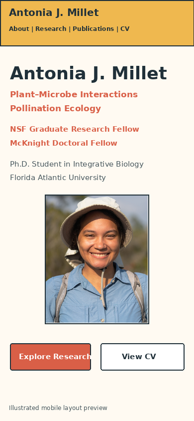

# 2. Plan Your Layout and Design

[← Previous: Plan your website content](01-plan-website-content.md) · [Return to the main guide](../README.md) · [Next: Understand your website files →](03-understand-website-files.md)

In Chapter 1, you decided what information your website should include. Now you will decide how to organize and visually present that information.

By the end of this chapter, you will have a simple plan for your website’s layout, colors, fonts, images, and mobile version.

## 2.1 Look at several academic websites

Looking at other academic websites can help you notice design choices you may want to use. Review at least three websites instead of basing your entire design on one person’s site.

As you look through each website, notice:

- what you learn about the person right away;
- how the homepage is organized;
- how research projects are presented;
- where the CV and publications are located;
- how images are used;
- whether the site has one page or several pages;
- how the site looks on a phone.

### Academic website examples

| Website | What to notice |
| --- | --- |
| [Cole J. Doolittle](https://coledoolittle.com/) | One-page organization and short project summaries |
| [Juan Pablo Jordán](https://jpj73.github.io/personal_website/about.html) | Simple pages and clear navigation |
| [Ken W. Zillig](https://kenzillig.github.io/aboutme/) | Research projects organized on separate pages |
| [Mitchell Fennell](https://mitch-fen.github.io/) | A GitHub Pages site with a clear academic structure |
| [Brian Lee](https://bhyleee.github.io/) | A compact homepage combining biography, research, and professional links |
| [Christopher Dutton](https://cldutton.github.io/aboutme/) | Clear research, teaching, and publications sections |
| [Luis D. Verde Arregoitia](https://luisdva.github.io/about/) | Research, publications, training, and writing presented together |

Websites may change over time. Use these examples as starting points rather than designs you must follow.

## 2.2 Save the design ideas you like

Create a file in your `website-materials` folder called:

```text
design-notes.txt
```

For each website, write down a few things you liked and disliked. You might notice:

- whether the navigation stays at the top of the page;
- whether the site uses one page or several pages;
- whether project descriptions are always visible or expand when selected;
- how photographs are placed beside text;
- how colors separate different sections;
- whether the homepage feels clear or crowded.

After reviewing several websites, make two short lists:

```text
I like:
- one scrolling homepage
- a portrait near the introduction
- short project summaries
- expandable research cards
- a separate CV link
- photographs for major projects

I do not want:
- a blog
- long paragraphs on the homepage
- complicated animations
- a separate page for every project
- a full publication list on the homepage
```

Combine ideas from several websites rather than trying to reproduce one person’s design.

## 2.3 Choose a one-page or multi-page website

Decide whether visitors will scroll through one main page or move between several pages.

### One-page website

A one-page website places most sections on the same page. This may work well if:

- you are building your first website;
- you have a small number of projects;
- you want visitors to move easily through your work;
- you want a simpler website to maintain.

The CV, publications, and other resources can still open as separate links.

### Multi-page website

A multi-page website gives major topics their own pages. This may work well if:

- you have many projects or publications;
- individual projects need longer explanations;
- you share teaching resources or blog posts;
- one page would become too long or crowded.

A one-page layout is often the simplest starting point for a first academic website. You can add separate pages later. Record your choice in `design-notes.txt`.

## 2.4 Plan the order of the homepage

Return to the sections you selected in Chapter 1. Decide what visitors should see first and what order they should move through the site.

A simple order might be:

```text
Navigation
Name and research identity
Short introduction and portrait
About
Research or Projects
Teaching or Mentoring
Contact
Footer
```

The top of the homepage should quickly help visitors understand who you are, what you study or work on, where you are based, and where they can find your main work or CV.

Do not place every award, role, or project detail at the top. Begin with the most important information and provide more detail farther down the page.

## 2.5 Decide how each section should appear

Choose a format that fits the amount and type of information you have.

| Section | Possible format |
| --- | --- |
| Home | Name, short introduction, portrait, and important links |
| About | Two or three readable paragraphs |
| Research or Projects | Cards, expandable summaries, or separate project pages |
| Publications | Google Scholar link, selected publications, or a separate page |
| Teaching or Mentoring | Short statement, examples, or a list of activities |
| CV | A button or navigation link that opens a PDF |
| Contact | Email and professional profile links |

Several research projects may work well as cards. One major project may be clearer as a larger section with an image and several paragraphs.

## 2.6 Decide how to use images

Review the images you gathered in Chapter 1. Choose images that help visitors understand you or your work.

An image might:

- introduce you;
- show a study organism or field site;
- help explain a project;
- show laboratory or field methods;
- make projects easier to distinguish;
- display a clear research figure.

Avoid adding images only to fill empty space. For each image you may use, write:

```text
Image:
Possible section:
What it helps visitors understand:
```

You will resize, rename, and add the images to the website later.

## 2.7 Choose a simple visual style

You do not need a complete color and font system yet. Choose a simple starting point.

### Colors

- one dark color for most text;
- one light background color;
- one main accent color;
- one or two optional section colors.

Make sure text is easy to read against every background.

### Fonts

Use one or two readable fonts: one for headings and one for paragraphs and navigation. Avoid using several decorative fonts.

Record your ideas in `design-notes.txt`:

```text
Main text color:
Background color:
Accent color:
Heading font:
Paragraph font:
```

These choices can change once you begin building the site.

## 2.8 Sketch the desktop and mobile layouts

Make a simple sketch before editing code. You can use paper and pencil, Word, PowerPoint, Google Slides, Canva, Figma, or another drawing tool.

The sketch does not need to look polished. Use boxes and labels to show where each section will appear.

### Desktop example

```text
[Navigation]

[Name and research identity]
[Introduction]        [Portrait]

[About]

[Research project cards]

[Teaching or mentoring]

[Contact]

[Footer]
```

### Mobile example

```text
[Name]
[Introduction]
[Portrait]
[Important links]
[About]
[Research cards]
[Teaching or mentoring]
[Contact]
```



The layout may change on a phone, but the same important information should remain easy to find.

## 2.9 Review your design plan

Compare your design plan with the content you prepared in Chapter 1. Ask:

- Does the most important information appear early?
- Is every planned section useful?
- Does each image have a purpose?
- Does the homepage feel too crowded?
- Can visitors find the CV and contact information easily?
- Will the layout still make sense on a phone?
- Did I combine ideas from several websites?

## Checkpoint

Before continuing, you should have:

- reviewed at least three academic websites;
- a list of design choices you like and dislike;
- chosen a one-page or multi-page layout;
- decided the order of your website sections;
- planned how each section will appear;
- chosen possible colors and fonts;
- selected images with a clear purpose;
- sketched desktop and mobile layouts;
- saved your choices in `design-notes.txt`.

[← Previous: Plan your website content](01-plan-website-content.md) · [Return to the main guide](../README.md) · [Next: Understand your website files →](03-understand-website-files.md)
