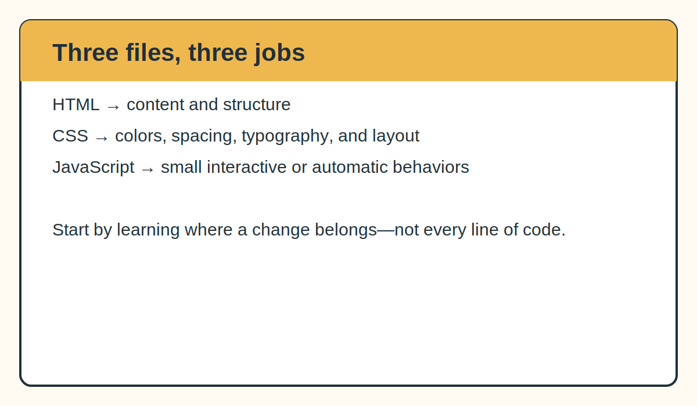

# 3. View and Understand the Code

[← Previous: Find design inspiration](02-find-design-inspiration.md) · [Return to the main guide](../README.md) · [Next: Customize your content →](04-customize-your-content.md)

You do not need to become a web developer before editing an academic website. You do need to recognize which file controls the part you want to change.



## The three main files

### `index.html`: content and structure

HTML tells the browser:

- this is the navigation;
- this is a heading;
- this is a paragraph;
- this is an image;
- this is a link;
- this is a research section.

Open [the example HTML](../example-website/index.html) and scan for section labels such as:

```html
<section id="about">
<section id="research">
<section id="mentoring">
<section id="contact">
```

The `id` gives the section a name that navigation links can target.

### `styles.css`: appearance and layout

CSS controls:

- colors;
- fonts;
- borders;
- spacing;
- card layouts;
- image cropping;
- desktop, tablet, and phone layouts.

Open [the example CSS](../example-website/styles.css) and look for comments such as:

```css
/* HEADER */
/* RESEARCH CARDS */
/* CONTACT */
/* MOBILE */
```

The variables near the beginning are especially useful:

```css
:root {
  --ink: #203039;
  --coral: #d95f47;
  --marigold: #efb84f;
  --teal: #24736c;
}
```

Changing a variable can update the color everywhere it is used.

### `script.js`: small behaviors

JavaScript should have a clear purpose. In the example site, it:

- inserts the current year in the footer;
- supports a menu button when one is present;
- measures the mobile header so anchored sections do not hide beneath it.

The website's main content still exists in HTML. The site does not depend on JavaScript for every paragraph or project.

## Understand file paths

This line:

```html

```

means:

1. begin in the folder containing `index.html`;
2. open `assets`;
3. open `images`;
4. load `about.jpeg`.

File and folder names must match exactly. On GitHub Pages:

```text
about.jpeg
```

is not the same as:

```text
About.jpeg
```

## Use comments as a map

Comments do not appear on the public page.

HTML comment:

```html
<!-- About section -->
```

CSS comment:

```css
/* PROJECT CARDS */
```

JavaScript comment:

```javascript
// Update the footer year
```

Comments are useful for explaining why a section exists and which values are safe to change.

## Learn by connecting code to the page

Use this sequence:

1. Open the example website in a browser.
2. Choose one visible item, such as the About heading.
3. Search for the same words in `index.html`.
4. Note the HTML classes surrounding it.
5. Search for those classes in `styles.css`.
6. Change one small value.
7. Refresh the browser.

Do not make ten unrelated changes before checking the result.

## Open the example locally

The simplest method is to open `example-website/index.html` in a browser.

A more reliable method is to use the **Live Server** extension in Visual Studio Code:

1. Open the `example-website` folder in VS Code.
2. Install the extension named **Live Server**.
3. Right-click `index.html`.
4. Select **Open with Live Server**.
5. Save a file and refresh the browser.

## Use the annotated notes

Read the notes that match the feature you are editing:

- [HTML overview](../code-notes/html-overview.md)
- [CSS overview](../code-notes/css-overview.md)
- [Navigation](../code-notes/navigation.md)
- [About section](../code-notes/about-section.md)
- [Project cards](../code-notes/project-cards.md)
- [Mobile layout](../code-notes/mobile-layout.md)
- [Analytics and redirects](../code-notes/analytics-and-redirects.md)

## Checkpoint

You should be able to answer:

- Which file contains the written content?
- Which file controls colors and spacing?
- Which file contains small interactive behaviors?
- How does an image path connect to a folder?
- Where would you look to change a section heading?
- Where would you look to change the mobile layout?

[← Previous: Find design inspiration](02-find-design-inspiration.md) · [Return to the main guide](../README.md) · [Next: Customize your content →](04-customize-your-content.md)
